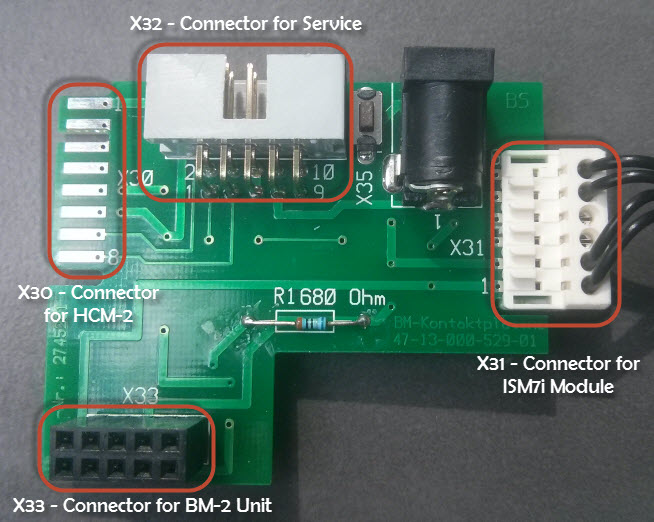

#eBus Binding

## Anschlussmöglichekeiten an den eBus

Bei der Heizung Wolf CSZ-2 kann man sich auf der Rückseite des Bedienmoduls BM2 Zugriff auf den eBus beschaffen.
Um die Anschlüsse zu bestimmen, habe ich die Platine aus der Heizung ausgebaut und durchgemessen.

### Pinbelegung
--- Fehlt---